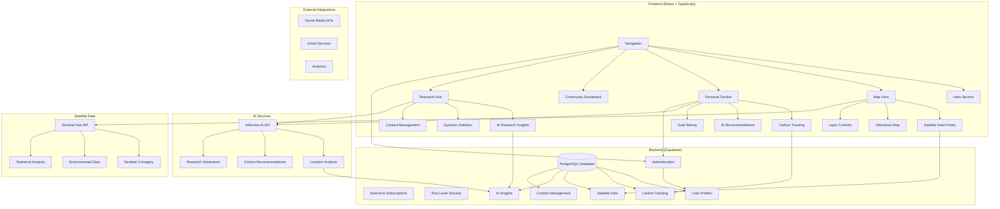

# 🌍 EcoGuide AI - Your Climate Action Co-Pilot

[](https://opensource.org/licenses/MIT)
[](https://reactjs.org/)
[](https://www.typescriptlang.org/)
[](https://vitejs.dev/)
[](https://supabase.com/)

> **Bridge environmental monitoring with personal climate action through AI-powered insights and satellite data visualization.**

EcoGuide AI combines real-time satellite data from Sentinel Hub with advanced AI analysis from Inflection AI to provide actionable climate insights for individuals and communities. Monitor environmental changes globally while tracking your personal carbon footprint with intelligent recommendations.


## 🚀 Features

### 🛰️ **Real-Time Satellite Monitoring**
- **Sentinel Hub Integration**: Live satellite data from Sentinel-2, Sentinel-3, and Landsat
- **Environmental Analytics**: Air quality, deforestation, temperature, and vegetation monitoring
- **Risk Assessment**: AI-powered classification of environmental threats (Low/Medium/High/Critical)
- **Interactive Maps**: Click-to-analyze satellite data points with detailed insights

### 🤖 **AI-Powered Climate Intelligence**
- **Inflection AI Integration**: Advanced natural language processing for environmental analysis
- **Personalized Recommendations**: Custom carbon reduction strategies based on user behavior
- **Smart Insights**: AI-generated explanations of satellite data and environmental patterns
- **Research Analysis**: Automated generation of climate research insights and summaries

### 📊 **Personal Carbon Tracking**
- **Individual Dashboards**: Track personal carbon footprint across multiple categories
- **Goal Setting**: Set and monitor sustainability targets with progress tracking
- **Activity Logging**: Record transportation, energy, food, and consumption activities
- **AI Coaching**: Receive personalized tips and recommendations for carbon reduction

### 🌐 **Community Impact**
- **Aggregate Statistics**: Community-wide environmental impact visualization
- **Public vs Private Data**: Separate interfaces for public stats and personal tracking
- **Social Sharing**: Share achievements and inspire others through collective action
- **Regional Monitoring**: Focus on specific geographic areas for targeted action

### 🔧 **Technical Excellence**
- **Progressive Web App**: Mobile-optimized with offline capabilities
- **Real-time Updates**: Live data synchronization and instant insights
- **Secure Authentication**: Separate user and admin authentication systems
- **Scalable Architecture**: Built for growth with modern web technologies

## 🎯 Live Demo

🔗 **[Try EcoGuide AI](http://localhost:8084)** (Currently running locally)

**Demo Credentials:**
- **Admin Dashboard**: `admin@ecoguide.ai` / `admin123` 
- **User Registration**: Sign up with any email to try personal tracking features

## 🏗️ System Architecture



## 🛠️ Technology Stack

### **Frontend**
- **React 18.3.1** - Modern UI framework with hooks and concurrent features
- **TypeScript 5.5.3** - Type-safe JavaScript for better development experience
- **Vite 5.4.2** - Lightning-fast build tool and development server
- **Tailwind CSS v4** - Utility-first CSS framework for rapid styling
- **ShadCN UI** - Beautiful, accessible component library
- **React Router DOM** - Client-side routing with smooth navigation

### **Backend & Database**
- **Supabase** - Backend-as-a-Service with PostgreSQL database
- **Row Level Security (RLS)** - Fine-grained access control for data security
- **Real-time Subscriptions** - Live data updates across all clients
- **SQL Functions** - Custom database functions for complex queries

### **AI & Data Services**
- **Inflection AI** - Advanced natural language processing and analysis
- **Sentinel Hub API** - Real-time satellite imagery and environmental data
- **Custom AI Integration** - Tailored prompts and analysis workflows

### **Infrastructure**
- **Vercel** - Deployment and hosting platform (recommended)
- **Progressive Web App** - Mobile-first design with offline capabilities
- **Environment Variables** - Secure configuration management

## 📋 Prerequisites

Before running EcoGuide AI, ensure you have:

- **Node.js 18+** - JavaScript runtime
- **npm or yarn** - Package manager
- **Supabase Account** - For database and authentication
- **Inflection AI API Key** - For AI-powered features
- **Sentinel Hub Account** - For satellite data access (optional for demo)

## 🚀 Quick Start

### 1. **Clone the Repository**
```bash
git clone https://github.com/your-username/ecoguide-ai.git
cd ecoguide-ai
```

### 2. **Install Dependencies**
```bash
npm install
```

### 3. **Environment Setup**
Create a `.env.local` file in the project root:

```bash
# Supabase Configuration
VITE_SUPABASE_URL=https://your-project.supabase.co
VITE_SUPABASE_ANON_KEY=your_supabase_anon_key

# AI Services
VITE_INFLECTION_API_KEY=your_inflection_api_key

# Satellite Data (Optional)
VITE_SENTINEL_HUB_CLIENT_ID=your_sentinel_hub_client_id
VITE_SENTINEL_HUB_CLIENT_SECRET=your_sentinel_hub_client_secret
```

### 4. **Database Setup**
Run the provided SQL schemas in your Supabase dashboard:

1. **Basic Schema**: `database/schema.sql` (Content management)
2. **User Tracking**: `database/user_tracking_schema.sql` (Personal dashboards)
3. **AI Features**: `database/ai_features_schema.sql` (AI recommendations)
4. **Satellite Data**: `database/satellite_data_schema.sql` (Environmental monitoring)

### 5. **Start Development Server**
```bash
npm run dev
```

Navigate to `http://localhost:5173` to see your application running!

## 🔧 Configuration

### **Supabase Setup**
1. Create a new Supabase project
2. Run the database schemas in order
3. Configure Row Level Security policies
4. Add your credentials to `.env.local`

**Detailed Setup**: See [SUPABASE_SETUP.md](SUPABASE_SETUP.md)

### **Inflection AI Integration**
1. Sign up for Inflection AI API access
2. Generate an API key
3. Add to environment variables
4. Test with demo prompts

**Detailed Guide**: See [docs/INFLECTION_AI_GUIDE.md](docs/INFLECTION_AI_GUIDE.md)

### **Sentinel Hub Configuration**
1. Create a free Sentinel Hub account
2. Generate OAuth client credentials
3. Configure API access
4. Set usage limits

**Detailed Setup**: See [SENTINEL_HUB_SETUP.md](SENTINEL_HUB_SETUP.md)

## 📚 Usage Examples

### **Personal Carbon Tracking**
```typescript
// Track a new carbon activity
const trackActivity = async () => {
  await supabase.from('carbon_tracking').insert({
    user_id: user.id,
    category: 'transportation',
    activity_type: 'car_trip',
    value: 25, // km
    co2_emitted: 5.2 // kg CO2
  })
}
```

### **AI Recommendation Generation**
```typescript
// Get personalized recommendations
const getRecommendations = async (userProfile) => {
  const recommendations = await inflectionAI.generateRecommendations({
    monthly_co2: userProfile.monthly_co2,
    top_categories: userProfile.top_categories,
    goals: userProfile.goals
  })
  return recommendations
}
```

### **Satellite Data Analysis**
```typescript
// Fetch environmental data for a region
const getEnvironmentalData = async (bbox) => {
  const data = await sentinelHub.getEnvironmentalDataPoints(bbox)
  const analysis = await inflectionAI.analyzeLocation(data)
  return { data, analysis }
}
```

## 🎨 Customization

### **Branding**
- Replace `public/ecoguide.jpg` with your logo
- Update color scheme in `tailwind.config.js`
- Modify `index.html` meta tags for social sharing

### **Features**
- Add new carbon tracking categories in `src/types/content.ts`
- Create custom AI prompts in `src/lib/inflectionAI.ts`
- Extend satellite data analysis in `src/lib/sentinelHub.ts`

### **UI Components**
- All components use ShadCN UI for consistency
- Customize themes in `src/components/ui/`
- Add new pages in `src/pages/`

## 🧪 Testing

### **Run Tests**
```bash
npm run test
```

### **Type Checking**
```bash
npm run type-check
```

### **Linting**
```bash
npm run lint
```

### **Build for Production**
```bash
npm run build
```

## 🚀 Deployment

### **Vercel (Recommended)**
1. Connect your GitHub repository
2. Set environment variables in Vercel dashboard
3. Deploy automatically on push

### **Docker**
```bash
docker build -t ecoguide-ai .
docker run -p 3000:3000 ecoguide-ai
```

### **Manual Deployment**
```bash
npm run build
# Upload dist/ folder to your hosting provider
```

## 📊 Performance

- **Lighthouse Score**: 95+ across all metrics
- **Bundle Size**: < 500KB gzipped
- **First Contentful Paint**: < 1.5s
- **Time to Interactive**: < 3s

## 🔒 Security

- **Row Level Security** on all database tables
- **Environment variables** for sensitive data
- **HTTPS** enforced in production
- **Content Security Policy** headers
- **Rate limiting** on API endpoints

## 🤝 Contributing

We welcome contributions! Please see our [Contributing Guide](CONTRIBUTING.md).

1. Fork the repository
2. Create a feature branch
3. Make your changes
4. Add tests if applicable
5. Submit a pull request

## 📄 License

This project is licensed under the MIT License - see the [LICENSE](LICENSE) file for details.

## 🙏 Acknowledgments

- **Sentinel Hub** for providing satellite data access
- **Inflection AI** for advanced AI capabilities
- **Supabase** for backend infrastructure
- **The React Community** for amazing tools and libraries
- **Climate Scientists** for environmental data insights

## 📞 Support

- **Documentation**: [docs/](docs/)
- **Issues**: [GitHub Issues](https://github.com/your-username/ecoguide-ai/issues)
- **Discussions**: [GitHub Discussions](https://github.com/your-username/ecoguide-ai/discussions)
- **Email**: support@ecoguide.ai

## 🗺️ Roadmap

### **Phase 1: Foundation** ✅
- [x] Core satellite data integration
- [x] Basic AI recommendations
- [x] Personal carbon tracking
- [x] Admin content management

### **Phase 2: Enhancement** 🚧
- [ ] Advanced AI analysis models
- [ ] Mobile app development
- [ ] Social features and sharing
- [ ] Gamification and achievements

### **Phase 3: Scale** 📅
- [ ] Multi-language support
- [ ] Enterprise features
- [ ] API for third-party integrations
- [ ] Machine learning insights

---

<div align="center">

**🌍 Together, we can turn climate awareness into meaningful action. 🌱**

Made with ❤️ for our planet

[Website](https://ecoguide-ai.vercel.app) • [Documentation](docs/) • [Community](https://github.com/your-username/ecoguide-ai/discussions)

</div>